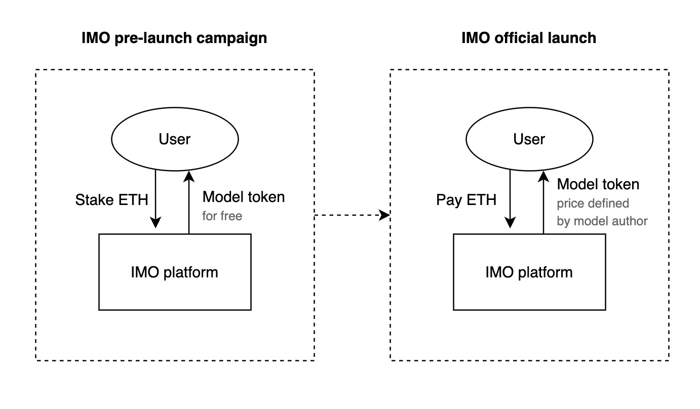
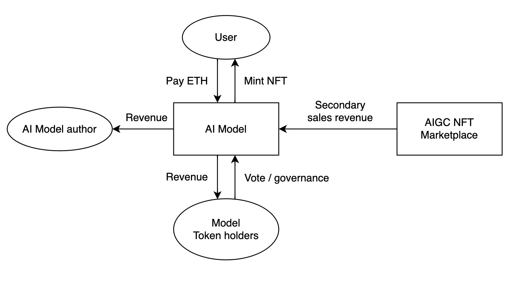

# Protocol Design

The Gold Shovel - Initial Model Offering (IMO) protocol is introduced as a pioneering mechanism aimed at addressing the monetization challenges encountered by open-source AI projects. These challenges primarily revolve around the sustainability of open-source models and the need to provide economic incentives for creators while preserving transparency and accessibility.

The IMO protocol encompasses a well-defined process:

- Model Tokenization: AI model creators initiate the IMO process by tokenizing their models, converting them into AI Model Tokens. These tokens serve as digital representations of model ownership and value within the blockchain ecosystem.
- Token Sale: Model creators conduct a token sale event, during which users can acquire AI Model Tokens, thereby supporting the ongoing development and monetization of the AI model.
- Revenue Sharing: As the AI model generates revenue through its usage, a predefined portion of these earnings is distributed proportionally among AI Model Token holders. This mechanism ensures equitable compensation for contributors to the model's success.
- Governance Framework: AI Model Token holders actively participate in the governance of the AI model. They engage in decision-making processes related to model updates, enhancements, and configuration adjustments, promoting a decentralized and collaborative model management approach.

The IMO process, as depicted in Diagram 1, involves two critical phases: the pre-launch and the official launch. Initially, during the pre-launch stage, users have the opportunity to stake ETH to acquire AI Model tokens at no cost. This phase primarily functions as a marketing strategy, assessing the popularity of a particular AI model and increasing visibility within the cryptocurrency community. Subsequently, the official launch commences after a set duration, wherein users can purchase AI Model tokens using ETH. These tokens play a pivotal role in the governance and voting processes of the AI model and also determine the revenue share percentage allocated to each token holder. (Diagram 2) The revenue comes from not only the AIGC nft minting sales, but also the secondary sales in the NFT marketplace.

